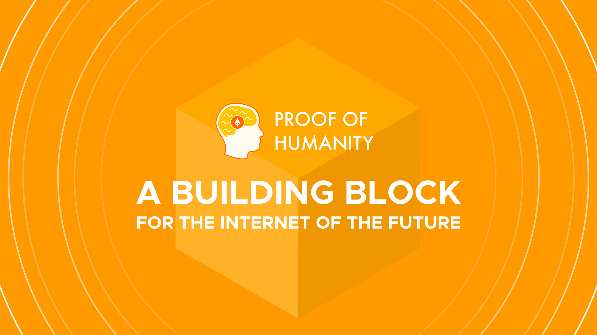

# ¿Qué es Proof of Humanity?

Proof of Humanity (PoH, Prueba de Humanidad en español) es un sistema social de verificación de identidades de humanos en Ethereum. Combina redes de confianza, test de Turing inversos y resolución de disputas para crear una lista de humanos a [prueba de ataques Sybil](https://es.wikipedia.org/wiki/Ataque\_Sybil).

La creación de este tipo de registro de identidad no es un fin en sí mismo. Es un punto de entrada a una multitud de nuevos casos de uso que requieren la resistencia a los ataques sybil (resistencia a la duplicación) y también para conectarse a una variedad de aplicaciones existentes y nuevas que necesitan este tipo de sistemas de identidad.

### Algunos posibles casos de uso para Proof Of Humanity.

#### Renta Basica Universal – $UBI 

La tecnología de registro Proof of Humanity permite una forma de distribución verdaderamente universal y más justa para los proyectos de UBI, ya que la única condición para recibirla sería estar registrado como humano verificado.

#### Innovadores sistemas de DAO.

Las DAO y las aplicaciones que utilizan el registro PoH para comprobar la "humanidad" de los votantes pueden experimentar con sistemas verdaderamente democráticos (1 persona = 1 voto) y con características innovadoras de votación preferencial o [voto cuadrático](https://es.wikipedia.org/wiki/Votaci%C3%B3n\_cuadr%C3%A1tica) para las que se requiere resistencia a los Sybil.

#### Identificaciones universales.

Las cuentas creadas en PoH pueden utilizarse directamente como método universal de inicio de sesión: imagina que las dapps reconocen a los usuarios automáticamente sin necesidad de registrarse.

#### Sistemas de certificación y reputación.

Se podrían añadir varias certificaciones o puntos de reputación (como la puntuación de crédito) a los perfiles del PdH.

Los individuos registrados seleccionarían las certificaciones que quieren que se hagan públicas. Estas podrían ser confirmadas por entidades centrales o a través de un registro curado y mostradas como una insignia en el perfil individual.

#### Airdrops resistentes a los ataques sybil.

Los airdrops son una forma popular de distribuir tokens. Sin embargo, incluso cuando se requerían diferentes formas de identificación (cuentas de telegramas, pasaportes), esos airdrops solían ser objeto de ataques sybil.

Esto condujo a un cambio hacia los airdrops proporcionales al saldo del usuario de una moneda específica y los lock-drops (donde los usuarios necesitan bloquear algunas monedas y recibir tokens proporcionalmente). Estas técnicas, a pesar de ser resistentes a los ataques sybil, benefician a los usuarios que ya tenian una gran cantidad de cripto-tenencias.

Proof Of Humanity permitiría realizar airdrops resistentes a ataques sybil, en los que los participantes recibirán cada uno la misma cantidad de monedas.

#### Herramientas anti-spam.

Los sistemas suelen utilizar captchas (pequeños ejercicios que ponen a prueba la capacidad del usuario para analizar una imagen o un sonido y que son difíciles de completar para las IA) antes de permitir una acción del usuario para evitar el spam.

Estos son una pérdida de tiempo para el usuario y no evitan el spam de un usuario decidido que estaría dispuesto a dedicar el tiempo necesario para resolverlos (o subcontratar la solución). Se podría permitir a las personas en el registro PoH un número de interacciones sin captcha (potencialmente lo suficientemente alto como para que nunca tengan que rellenar un captcha).

Los usuarios que hagan spam en los sistemas que utilicen este caso de uso podrían ser expulsados temporal o permanentemente.

#### Sidechains aseguradas por el consenso de PoH. 

PoH también podría utilizarse para crear un nuevo tipo de sidechain asegurada por la Prueba de Identidad con el principio de "1 persona = 1 voto". Esto supondría una mayoría honesta de humanos en el registro y funcionaría de forma similar a las sidechains de Prueba de Autoridad.

### Proof Of Humanity es una DAO.

#### Pero primero… ¿Qué es una DAO?

Blockchain como tecnología nos permitio descubrir nuevas formas de organizarnos en comunidad. Una de ellas son las DAO o Organizaciones Autonomas Descentralizadas.

Para entender a que se refiere este nuevo concepto quizas sea bueno entender las palabras que lo conforman:

1. **Organización:** grupo de individuos que se reúnen y trabajan en conjunto para lograr un objetivo y fin determinado.
2. **Autónoma:** entidad que goza de la capacidad para actuar de forma independiente a agentes externos.
3. **Descentralizada:** no cuenta con una autoridad central; las funciones se encuentran dispersas y cada uno de los miembros tiene el poder de emitir su voto.

Entonces una DAO es comunidad que trabaja en conjunto para cumplir una misión; las decisiones son tomadas únicamente por los miembros de la comunidad y cada uno de ellos tiene la capacidad de votar.

#### Alguna de las caracteristicas de las DAO.

*   #### **Basadas en blockchain y smart contracts.**

    Las DAO están basadas en blockchain y las reglas del juego definidas dentro de smart contracts, que son scripts de código que realizan una acción determinada a partir de un evento.

    Esta característica hace que este tipo de organizaciones gocen de una mayor **transparencia**, dado que, su actividad queda registrada en la red y cualquier persona es capaz de ver qué está haciendo la organización con sus recursos.

    Esto también permite que haya una mejor rendición de cuentas y que los miembros tengan claro que los recursos se usarán para el fin por el cual votaron, ya que este queda definido dentro de un smart contract cuyo código puede ser visto por cualquiera.
*   **Impulsadas por una misión.**\
    ****Este tipo de organizaciones nacen a partir de un objetivo que se desea cumplir. Los miembros trabajan en conjunto para crear, capturar y compartir valor con relación a una **misión compartida**.

    La meta principal puede ser resolver un problema, generar valor o simplemente comprar algo.
* **Propiedad de la comunidad.**\
  ****La DAO en su totalidad le pertenece a la comunidad que ayuda a construirla. Todos aquellos que apoyan el proyecto y deciden invertir en él, ya sea dinero o tiempo para conseguir la misión que dio origen a la organización.

#### **Entonces ¿Cuál es mi rol en Proof Of Humanity DAO?**

Al registrarte en PoH ganas el derecho a votar en las decisiones de mejoras del sistema. TO BE CONTINUED
