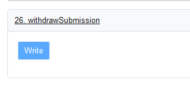

# Proof of Humanity FAQ

## ¿Cuál es el propósito de la Prueba de Humanidad?

[​Proof of Humanity ](https://www.proofofhumanity.id/)es un sistema que combina la verificación social con el envío de videos para crear una lista de humanos a prueba de Sybil. Está destinado a ser utilizado por individuos como un punto de entrada a una miríada de nuevos casos de uso que requieren la resistencia de Sybil para poder implementarse a escala y también para conectarse a una variedad de aplicaciones existentes y nuevas en necesidad. para tales sistemas de identidad.

## ¿Por qué debo registrarme en PoH? ¿Cuáles son sus casos de uso? 

Consulte los numerosos casos de uso de prueba de humanidad en esta [publicación](https://blog.kleros.io/proof-of-humanity-a-building-block-for-the-internet-of-the-future/) .

## ¿Cuál es la conexión entre la Prueba de humanidad y el UBI Token? 

Proof of Humanity es un dapp creado con el propósito de crear una lista de humanos resistentes a Sybil. El token UBI es una moneda de ingreso universal que acumulan todos los perfiles registrados con éxito en el registro de Prueba de humanidad. Para obtener más información sobre el UBI Token, consulte la publicación del [anuncio de UBI](https://blog.kleros.io/introducing-ubi-universal-basic-income-for-humans/) .

## ¿Cómo uso el registro de Prueba de humanidad? 

Consulte el [artículo explicativo completo](https://blog.kleros.io/proof-of-humanity-an-explainer/) para aprender a interactuar con Prueba de humanidad.

## ¿Puedo, como individuo individual, presentar más de una identidad para la Prueba de humanidad? 

No, no puedes.

## ¿Qué dirección de Ethereum debo usar para registrarme en Prueba de humanidad? 

La dirección de Ethereum que está utilizando para enviar su perfil se vinculará públicamente a su identidad. Si no desea que las tenencias de su billetera y el historial de transacciones se vinculen con su identidad, le recomendamos que utilice una nueva dirección de Ethereum con fondos de un intercambio de criptomonedas o que provenga de [Tornado.cash.](https://tornado.cash/)\

## ¿Por qué fases pasará mi perfil antes de ser registrado? 

Una vez que haya enviado su perfil, estará en la "Fase de verificación" hasta que obtenga una garantía y su depósito se financie por completo. Inicialmente, solo necesitará 1 persona para responder por usted (permite una incorporación más rápida en el registro en el lanzamiento), pero la cantidad de comprobantes necesarios se puede aumentar más adelante. Luego, su perfil pasará a la fase "Registro pendiente", durante que cualquiera puede impugnarlo por un período de 3,5 días si cree que no es humano o si viola [las reglas del registro](https://ipfs.kleros.io/ipfs/QmcT8TUxLEHistCnkmGERcEuVtMfMPhXcMDTxfBTYahqEh/proof-of-humanity-registry-policy-v1.2.pdf). Si su perfil no se impugna durante este período o las impugnaciones no tienen éxito, está "Registrado". Si se impugna, volverá a la fase "Registro pendiente" o será "Eliminado" según la decisión Kleros Court. Una vez que esté "Registrado", su perfil puede caducar después de un año (si no vuelve a presentar la solicitud) o alguien puede realizar una solicitud de eliminación que lo moverá a la fase "Eliminación pendiente" durante la cual cualquiera puede impugnar la eliminación.&#x20;

Si su perfil está "Caducado", "Eliminado" o está a punto de caducar pronto, puede volver a solicitar el envío, lo que lo llevará de vuelta a la "Fase de verificación"

Puede obtener más información sobre cómo funciona el sistema de impugnación y resolución de disputas en Kleros Court. [Documentación](https://kleros.gitbook.io/docs/products/court)

## ¿Por qué debería responder por alguien? ¿Qué hay para mi ahí dentro?

Responder por alguien es un acto benévolo para ayudar a que las personas que conoce sean aceptadas en el registro. Ten cuidado con quién respondes. Si por error (o exceso de confianza) respondes por un usuario malicioso, serás penalizado.

¿Qué sucede si respondo por un usuario malicioso?

Si se rechaza un envío por motivos de "Duplicado" o "No existe", todas las personas que habían respondido por el perfil rechazado serán eliminadas del registro. Esto permite eliminar a los atacantes maliciosos que responden por los bots. También significa que debe tener cuidado al dar fe: asegúrese de conocer a esta persona en la vida real y que no sea un duplicado.

## ¿De cuántas personas puedo dar fe? 

Puede responder por tantas personas como desee. Sin embargo, su bono solo contará para una persona a la vez en el orden en que se les entregó. Un comprobante de usuario solo se puede usar para un envío a la vez según el orden de llegada. Por ejemplo, suponga que el usuario A está registrado. A avala al usuario B. El usuario B utiliza el aval y pasa a la fase "Pendiente de alta". Luego, A responde por el usuario C. Dado que B ya está utilizando el comprobante de A, C permanece en la "Fase de emisión de comprobantes" por ahora, pero pasará a la fase "Pendiente de registro" una vez que B esté registrado.

## ¿Puedo quitar un bono? 

Puede eliminar su cupón en cualquier momento antes de la fase de "Registro pendiente" yendo al perfil de la persona con cupón y haciendo clic en "Eliminar cupón".

## ¿Cuándo se reembolsa mi depósito? 

Su depósito será reembolsado poco después de que pase al estado "Registrado". Puede confirmar el estado de la transacción de reembolso en [Etherscan ingresando](https://etherscan.io/) su dirección y luego haciendo clic en la pestaña "Txns internos". _Nota: Como se trata de una transacción interna, a diferencia de la transacción de depósito, no verá la transacción de reembolso en la pestaña "Actividad" de Metamask._

## ¿Cuánto dura el registro? 

Las inscripciones tienen una duración de dos años. Esto significa que los usuarios deben volver a aplicar periódicamente al registro. El propósito del período de registro limitado es eliminar a las personas que mueren y las presentaciones maliciosas que podrían haber llegado a la lista. Las condiciones para volver a presentar la solicitud son similares a las de la solicitud original. Puede volver a presentar la solicitud antes de que finalice el período de registro actual para evitar pasar algún tiempo sin registrarse. Los usuarios que vuelven a presentar la solicitud (de modo que tengan el comprobante y el depósito requeridos) antes de que finalice su registro se consideran registrados durante todo el período de su nueva solicitud.

## ¿Qué reglas debo seguir para enviar un perfil adecuado o eliminar uno incorrecto? 

Comprobar las [Politicas de Proof of Humanity ](https://ipfs.kleros.io/ipfs/QmcT8TUxLEHistCnkmGERcEuVtMfMPhXcMDTxfBTYahqEh/proof-of-humanity-registry-policy-v1.2.pdf)para obtener todas las condiciones detalladas para que un perfil sea aceptado o rechazado del registro.

¿Puedo solicitar que se elimine el perfil de otra persona del registro?

A request to remove a registered submission from the list can be made at any time by submitting a deposit. Anyone can put a deposit claiming the registration to be correct. If no one does, the individual is removed from the list. If someone does, a dispute is created. Note that in case of a successful removal request, people vouching for the user are not removed from the list.

## Quiero eliminar mi perfil y enviarlo de nuevo porque quiero cambiar algo al respecto. ¿Cómo procedo? 

### SI SU PERFIL AÚN SE ENCUENTRA EN "FASE DE VALE" 

Todavía no hay una opción en la aplicación para eliminar un perfil en la "Fase de emisión de comprobantes" (se agregará pronto). Por ahora, deberá interactuar directamente con el contrato inteligente:

.png>)

1\. Vaya a la página Etherscan del [contrato de PoH](https://etherscan.io/address/0xC5E9dDebb09Cd64DfaCab4011A0D5cEDaf7c9BDb#writeContract)​

2.Conecte su billetera (busque el botón "Conectar a Web3"). IMPORTANTE: Tiene que ser la misma billetera que usas para registrarte.

3\. Busque la función de retiro de envío (es la última). Haga clic para ampliar.

4.Haga clic en "Escribir". Metamask podría sugerir un límite de gas loco, pero la función debería costar solo alrededor de 50k de gas.

5.Confirme el Tx y recuperará su depósito y su perfil cambiará a "Eliminado".

### SI SU PERFIL YA ESTÁ "REGISTRADO"  

Primero, debe eliminar su propio perfil obsoleto y luego volver a presentar una solicitud o enviarlo con otra dirección para un nuevo registro. Para eliminar su antiguo perfil registrado, debe ir a la página de su perfil registrado y hacer clic en el botón "Solicitar eliminación" y luego proporcionar evidencia de que usted es el remitente.

.png>)

_**Ejemplo 1. Enviar una solicitud de eliminación desde la misma dirección que el remitente.**_&#x20;

**Nombre de la evidencia:** Autoeliminación de la presentación.&#x20;

**Descripción de la evidencia:** soy el remitente según lo demuestra mi dirección y deseo eliminar este envío.&#x20;

_**Ejemplo 2: envíe una solicitud de eliminación desde una dirección diferente a la del remitente.**_

**Nombre de la evidencia:** Autoeliminación de la presentación.&#x20;

**Descripción de la evidencia:** soy el remitente y quiero eliminar este envío. El video adjunto es una grabación de mí mismo diciendo la oración "Quiero eliminar mi propia presentación del registro de Prueba de humanidad".

## ¿Por qué el registro comenzó con algunos usuarios ya registrados en él?

Dado que requerimos que los usuarios garanticen los nuevos miembros, tuvimos que comenzar con un conjunto inicial de usuarios confiables y seleccionados manualmente. Aquellos registrados a través del evento de siembra tendrán que confirmar periódicamente su registro como cualquier otro usuario.

## ¿Por qué no puedo mostrar mi ENS en mi video de envío? 

Para reducir la superficie de ataque en el lanzamiento, decidimos no permitir mostrar o usar ENS. Un usuario podría perder el control de su ENS, olvidarse de renovarlo o ser superado. Optamos por vincular la propiedad del perfil a la propiedad simple y directa de la dirección de Ethereum que lo envió. Esto podría cambiar en el futuro a través de Kleros Governance.

## ¿Por qué se implementa la aplicación Proof of Humanity en la red principal de Ethereum, donde las tarifas de gas son altas? 

El registro Proof of Humanity se implementa en la red principal de Ethereum porque es donde sus propiedades contra los ataques de Sybil son más útiles y permitirá que más dapps lo usen. También se basa en varios otros contratos, como Kleros Court, que aún no se implementan en soluciones de capa 2. El contrato PoH se ha optimizado para el gas tanto como sea posible para reducir las tarifas de gas al interactuar con él. Somos conscientes de que las tarifas de gas en la red principal son altas, pero creemos que la distribución constante de UBI compensará las tarifas pagadas por los titulares de tokens para ingresar al registro. En el futuro, Kleros DAO tendrá el poder de decidir si es viable migrar el registro PoH a una solución de Capa 2.

## A medida que los deepfakes mejoren, ¿podrán los retadores mantenerse al día tecnológicamente para defenderse de esto? 

Es probable que las mejoras en el aprendizaje automático afecten la eficacia de los algoritmos de creación y detección de deepfakes. Si los algoritmos logran producir falsificaciones profundas no detectables por otros algoritmos, se necesitarán otras pruebas. Esto se puede decidir a través del proceso de gobierno de Kleros.

## ¿Qué pasa si mi religión me prohíbe mostrar mi rostro? ¿Qué pasa si no puedo hablar físicamente? 

Las características internas del rostro son las más importantes para el reconocimiento facial (consulte [este artículo](https://twin.sci-hub.tw/6930/15eaafba29e330ca74f92b4ef05e57c9/toseeb2014.pdf) ) y eliminar el requisito de pronunciar la oración disminuiría la seguridad del sistema (el análisis de voz se puede usar para detectar registros múltiples). Por el momento, estos casos límite no permiten registrar a la persona. Si tiene una propuesta que permitiría el registro seguro de este caso extremo (y otros), puede enviarla a través del proceso de gobernanza.

## ¿Qué pasa si tengo un gemelo idéntico que también quiere ser registrado? 

Si bien la mayoría de las personas tienen dificultades para distinguir a los gemelos, los gemelos idénticos no son realmente idénticos y pueden ser distinguidos por personas capacitadas. Además, los algoritmos de reconocimiento facial tienden a hacer un mejor trabajo que los humanos al distinguir entre gemelos. Esto significa que una presentación de un gemelo podría ser impugnada, pero el gemelo probablemente podría proporcionar evidencia fácilmente de que es un gemelo para ganar la disputa.
